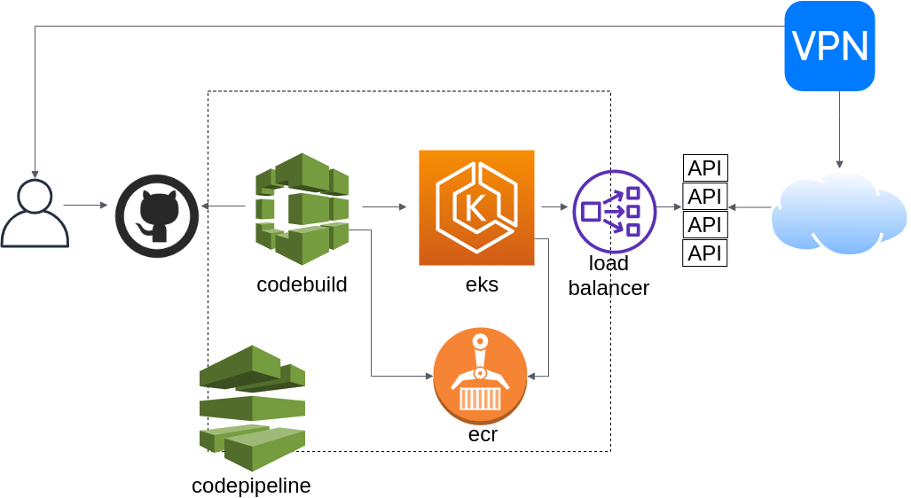

# Deployment do serviços: Uma abordagem ops

Neste desafio, o esperado é que o resultado de seus builds, sejam imagens docker e artefatos aptos a serem "deployados" em um cluster
kubernetes.

neste caso, usando Amazon EKS. O diagrama abaixo pode ajudar a ilustrar o cenário proposto:

*Não se preocupe com a infraestrutura, todo o ambiente está pronto e aguardando o seu projeto =)*

## Necessidades

O artefato do build de seu projeto é uma imagem docker, por isso, é necessário criar o arquivo Dockerfile para conteinerizar sua app.

## Informações de suporte

- Dúvidas em como criar um Dockerfile [Esse link](LINK-PARA-O-CONTEUDO) tem uma explicação sobre como você pode fazer isso.

## Como nós implementamos

Quer saber como nós da Zup Edu implementamos esse serviço? [Neste vídeo](AQUI-DEVERA-TER-O-LINK-DO-VIDEO-QUE-SERA-EDITADO) Você verá como foi o passo que seguimos para realizar essa tarefa.
