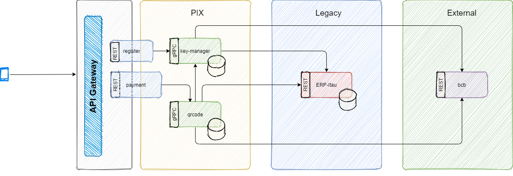

# Desafio: Pix

Recentemente o Banco Central do Brasil (BCB) trouxe ao mercado o **Pix**. Em poucas palavras, o Pix é um novo meio de pagamentos para fazer transferências de forma rápida, sem esperar dias para que o pagamento “caia” na conta de quem o receberá ou ter que fazê-los só em dias da semana, no horário comercial. Além de poder transferir dinheiro para outras pessoas, será possível também fazer pagamentos a estabelecimentos usando o Pix, por exemplo.

Com o Pix, pagamentos e transferências são **concluídos em alguns segundos** e podem ser feitos a qualquer horário e dia, incluindo finais de semana e feriados. O Pix vai, portanto, facilitar e agilizar as transferências de valores entre pessoas e estabelecimentos comerciais, o pagamento de contas e até recolhimento de impostos e taxas de serviços, entre outras possibilidades.

Vale dizer que para enviar ou receber um Pix, não é necessário fazer nenhum cadastro ou baixar um aplicativo – ele pode ser usado diretamente no aplicativo de sua instituição; é necessário somente que ela ofereça esse meio de pagamento. 

Dessa forma, nosso **objetivo** é garantir que nossos usuários possam efetuar pagamentos e transferências via Pix na nossa plataforma. Mais ainda, nossos usuários poderão registrar suas chaves Pix em nossa plataforma usando suas informações pessoais: CPF, telefone celular, email ou uma chave aleatória. Com uma chave registrada, será possível receber e pagar via Pix.

# Entendendo a Arquitetura do Projeto

# Outras informações 

[Bacen Open-API: Pix](https://github.com/bacen/pix-dict-api/tree/master/openapi)

# Indice

- [00 - Desafio: Pix](README.md)
- [01 - Arquitetura do projeto e tecnologias](001-arquitetura-do-projeto-e-ambiente.md)
    - [01.1 - Setup do ambiente]()
- [02 - Modulo Key-Manager](01-key-manager/)
    - [02.1 - Setup do projeto: key-manager-grpc](01-key-manager/001-setup-do-projeto-key-manager-grpc.md)
    - [02.2 - Registrando uma nova chave Pix](01-key-manager/005-registrando-uma-nova-chave-pix.md)
    - [02.3 - Removendo uma chave Pix existente](01-key-manager/010-removendo-uma-chave-pix-existente.md)
    - [02.4 - Registrando e excluindo chaves Pix no Banco Central (BCB)](01-key-manager/015-registrando-e-excluindo-chaves-pix-no-bcb.md)
    - [02.5 - Consultando os dados de uma chave Pix](01-key-manager/020-consultando-os-dados-de-uma-chave-pix.md)
    - [02.6 - Setup do projeto: key-manager-rest](01-key-manager/025-setup-do-projeto-key-manager-rest.md)
    - [02.7 - Expondo para o frontend: Registro da chave Pix](01-key-manager/030-expondo-para-o-frontend-registro-da-chave-pix.md)
    - [02.8 - Expondo para o frontend: Remoção de uma chave Pix existente](01-key-manager/035-expondo-para-o-frontend-remocao-de-uma-chave-pix-existente.md)
[- 03 - Modulo Payment (Cobrança)](02-payment)
    - [03.1 - Setup do projeto: payment-grpc](02-payment/001-setup-do-projeto-payment-grpc.md)
    - [03.2 - Gerando uma cobrança via Pix para QR Code](02-payment/005-gerando-uma-cobranca-via-pix-para-qrcode.md)
    - [03.3 - Pagando uma cobrança via Pix](02-payment/010-pagando-uma-cobranca-via-pix.md)
    - [03.4 - Setup do projeto: payment-rest](02-payment/015-setup-do-projeto-payment-rest.md)
    - [03.5 - Expondo para o frontend: Gerando cobranças via Pix para QR Code](02-payment/020-expondo-para-o-frontend-gerando-cobrancas-via-pix-para-qrcode.md)
    - [03.6 - Expondo para o frontend: Pagando cobranças via Pix](02-payment/025-expondo-para-o-frontend-pagando-cobrancas-via-pix.md)
[- 04 - Segurança](03-seguranca)
    - [04.1 - Autenticação e Autorização](03-seguranca/001-autenticacao-e-autorizacao.md)
    - [04.2 - Validando a chave Pix do usuário logado](03-seguranca/005-validando-a-chave-pix-do-usuario-logado.md)
[- 05 - Resiliência e Disponibilidade](04-resiliencia-e-disponibilidade)
    - [05.1 - O que acontece se o microservice Payment ficar fora do ar?](04-resiliencia-e-disponibilidade/001-o-que-acontece-se-o-microservice-payment-ficar-fora-do-ar.md)
    - [05.2 - O que acontece se o microservice Key-Manager ficar fora do ar?](04-resiliencia-e-disponibilidade/005-o-que-acontece-se-o-microservice-key-manager-ficar-fora-do-ar.md)
    - [05.3 - Melhorando a disponibilidade do microservice Payment através de Cache Distribuído](04-resiliencia-e-disponibilidade/010-melhorando-a-disponibilidade-do-microservice-payment-atraves-de-cache-distribuido.md)
    - [05.4 - Definindo timeout para todas as chamadas remotas](04-resiliencia-e-disponibilidade/015-definindo-timeout-para-todas-as-chamadas-remotas.md)
    - [05.5 - Lidando com falhas parciais e transientes: habilitando Retry](04-resiliencia-e-disponibilidade/020-lidando-com-falhas-parciais-e-transientes-habilitando-retry.md)